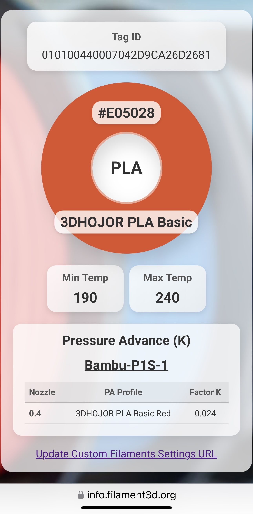
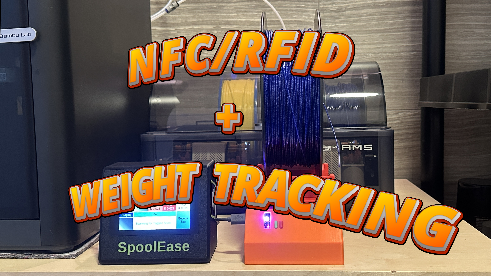

# SpoolEase System

This project is an ESP32-S3–based add-ons for Bambulab 3D printers (X1, P1, and A1 series) that simplifies filament spool management.

It includes two products:  
- **SpoolEase Console** – Encodes and decodes NFC tags attached to filament spools. These tags store filament data and spool weight, enabling automatic printer configuration when loading spools via the AMS or an external spool. It also shows which filaments are currently loaded.  
ℹ️ SpoolEase Console works independently and does not require SpoolEase Scale.  
- **SpoolEase Scale** – Newly released, this module weighs spools to track available filament, laying the foundation for a broader filament inventory system.  
ℹ️ SpoolEase Scale depends on SpoolEase Console to operate.

And most importantly, even though it’s an open-source project, it’s easy to build and surprisingly simple to set up!

## Star History

**I’d greatly appreciate it if you could star the GitHub repo as recognition to the efforts.**

## Press Below for Video Demonstration of SpoolEase Console

  
  

## Press Below for Video Demonstration of SpoolEase Scale

  

---

**Notice:** This is a new project currently in its early stages. While it has been installed by many happy users, new users should be aware that there are no warranties, liabilities, or guarantees, and they assume all risks involved.
## Collaboration

- For questions, feedback, comments, etc. please use the [repo discussions area](https://github.com/yanshay/SpoolEase/discussions)
- For getting notified on important updates, subscribe to the [Announcements Discussion](https://github.com/yanshay/SpoolEase/discussions/7)
- If you want to try your luck with immediate online response, try the [Discord Server](https://discord.gg/6brKUCERcQ)
- It would be real cool if you post your build in the [Introduce Your Build Discussion](https://github.com/yanshay/SpoolEase/discussions/8)

**I’d also greatly appreciate it if you could star SpoolEase GitHub repo.**

## Recommendations for Use at This Stage

- Please ensure you read through this page fully before building or using the devices—several important guidelines and tips are provided.
- If you encounter issues, please report them. If you believe it’s a bug, use the issues section; if you’re unsure about the behavior, raise it in the discussions section.
- Bambulab printers are not without their quirks, particularly with K Factor handling. The X1C behaves differently than the P1S, and even the P1S has been observed to experience issues that require a restart. While slicer-only use may obscure these problems, SpoolEase Console makes them more visible. If you notice issues, try restarting the printer to see if they persist.
- Understanding the K Factor / Flow Dynamic Calibrations / Pressure Advance (all referring to the same concept) is crucial for achieving quality prints, but configuring it on Bambulab printers (especially with Bambu Studio) is not very intuitive. You can read more about it [here](https://wiki.bambulab.com/en/software/bambu-studio/calibration_pa). It’s important to focus on this if you want to get the best performance from your printer and maximize the value of SpoolEase, which offers an advantage over other solutions in this regard, including Bambulab filaments own RFID tags.

## ⚠ Important Notice  

Bambulab has announced an upcoming firmware update that will restrict certain MQTT communications while the printer is in **"Cloud Connected"** mode. However, these messages will remain accessible in **"LAN Only"** mode with a new **Developer Mode** they plan to introduce.  

The first rollout of this firmware has already been released for the **X1 series**.  

This project relies on these MQTT messages for setting filament information on the printer (which is a primary feature). Encoding tags, scanning them, viewing them on your mobile phone, visibility into AMS filaments and weighting should work without an issue though. 

To continue using this project at its fullest, you have two options:  

1. **Do not update your firmware** – This will allow the project to work in Cloud Connected mode.  
2. **Update your firmware** – You must then switch to **LAN Only mode** and enable **Developer Mode**.  
3. **Limited functionality** - You can use SpoolEase without setting printer filament information, value would be mostly around spool weight in such case.

## Licensing Information

This project (including hardware designs, software, and case files) is freely available for you to build and use for any purpose, including within commercial environments. However, you may not profit from redistributing or commercializing the project itself. Specifically prohibited activities include:

- Selling assembled devices based on this project
- Selling kits or components packaged for this project
- Charging for the software or hardware designs
- Selling modified versions or derivatives
- Integrating the product, with or without modifications, into a commercial server offering, whether cloud-based or on-premise
- Offering paid installation, configuration, or support services specific to this project

To be clear: You CAN use this device in your business operations, even if those operations generate revenue. You CANNOT make money by selling, distributing, or providing services specifically related to this project or its components.

If you're interested in commercial licensing, redistribution rights, or other activities not permitted under these terms, please contact SpoolEase at gmail dot com for potential partnership opportunities.

## Required Components for SpoolEase Console

- **[WT32-SC01 Plus](https://www.aliexpress.com/item/3256805864064800.html)**  
  **Important:** make sure to pick the board and not accessories
- **7 wire cable with JST 1.25mm connector**  
  I received one in the box together with WT32-SC01-Plus
- **[PN532 NFC reader module](https://www.aliexpress.com/item/3256806852006648.html)**  
  **Important:** make sure to pick the module and not accessories
- **[8-wire cable with JST 1.25mm connector](https://www.aliexpress.com/item/1005007079265201.html)**  
  Optional but recommended in case of cable fault/soldering/different WT32-SC01 Plus packaging, instead of the 7-wire that's supposed to come with the WT32-SC01 Plus (**make sure to pick the 1.25mm connector size and 8 pins**)
- Power adapter capable of 2A current at 5V + USBC Cable (don't use the USB port on the printer!)
- **[3D Model of SpoolEase case](https://makerworld.com/en/models/1138678)**
- **4x M2x10 screws** to securely hold the display in place (not mandatory)
- NFC Tags (Ntag215) – Available in different types and qualities, including paper and PET stickers, typically round with a 25mm diameter. It’s recommended to test a few before purchasing in bulk. If using a dryer, ensure the adhesive is durable enough or choose a mounting method that prevents the stickers from falling off.
- **Soldering tools**
- (Optional) 3D Model of spool with place for NFC sticker tags - TBD

For components sourcing from Amazon EU/US, check out [this discussion](https://github.com/yanshay/SpoolEase/discussions/1).

## Required Components for SpoolEase Scale

- **[ESP32-S3-DevKit N16R8 board](https://www.aliexpress.com/item/1005005051294262.html)**  
  **Important**: Select the **ESP32-S3 N16R8 welded version**. This specific model is required due to its memory configuration—other variants will not work. The welded version avoids difficult pin soldering, making assembly easier. The 3D case was also designed around this board’s exact dimensions and component layout, including button and LED placement.  
  If you’re sourcing the board from a different supplier, double-check that it’s the exact same version. Look closely at the physical layout, available pins, and component positions—similar-looking DevKits exist, but may not be compatible.
- **[HX711 AD Module + LoadCell](https://www.aliexpress.com/item/1005001537354199.html)**  
  Select a LoadCell based on the heaviest spool you plan to measure. Typical 1kg spools usually weigh around 1.25kg. Choose a 2-5kg capacity load cell for optimal accuracy. SpoolEase Scale has been tested with 2kg and 3kg load cells.
- **[Dupont Wire Cable](https://www.aliexpress.com/item/1005008248101491.html)**  
  These wires connect the the ESP32-S3 to the HX711 and optionally to the PN532 module.
  - HX711 connection: 10cm length is sufficient (4 wires required)
  - PN532 connection: 20cm length recommended (7 wires required)  
    (Optional, if you want the extra PN532 scanning point and future functionality, see below PN532)
  - At least one side must be Female to connect to the ESP32-S3 pins
  - The other end depends on your preferred connection method:
    - Solder connectors to the boards (requires Female wire ends)
    - Solder Dupont Male pins to the boards
    - Direct soldering (wire end type irrelevant as it will be cut)
- **2x M5x30 Socket head screws**
- **2x M4x30 Socket head screws**
- Power adapter capable of 1A current at 5V + USBC Cable (don't use the USB port on the printer!)
- **Printed 3D Model parts for the SpoolEase Scale case**  
  While printing the model, feel free to boost it, and Star the GitHub Repo. Thanks!
- **Optional: [PN532 NFC reader module](https://www.aliexpress.com/item/3256806852006648.html)** (ensure you select the module, not accessories)  
  Currently serves as an extra tag scanning point. Future features may utilize this scanning point differently than the main SpoolEase console.

## Detailed Instructions
- **SpoolEase Console**  
  [Build](documentation/console-build.md)  
  [Setup](documentation/console-setup.md)  

- **SpoolEase Scale**  
  [Build](documentation/scale-build.md)  
  [Setup](documentation/scale-setup.md)

- **System Information**  
  [Usage](documentation/usage.md)  
  [Troubleshooting](documentation/troubleshooting.md)

## Third Party Attributions
SpoolScale uses the following sources for it's Spools Catalog:  
- Scuk's "Empty Spool Weight Catalog": https://www.printables.com/model/464663-empty-spool-weight-catalog
- https://www.onlyspoolz.com/portfolio/

## Licensing

This software is licensed under Apache License, Version 2.0 **with Commons Clause** - see [LICENSE.md](LICENSE.md).

- ✅ Free for use
- ❌ Cannot be sold, offered as a service, or used for consulting, see [LICENSE.md](LICENSE.md) for more details
- 📧 For commercial licensing inquiries about restricted uses, contact: **SpoolEase at Gmail dot Com**
