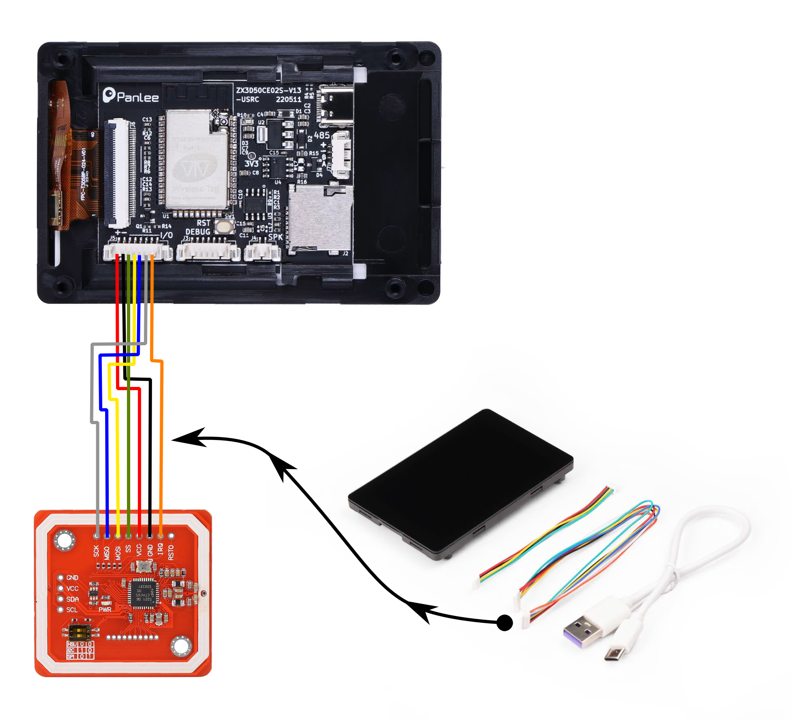

# SpoolEase Build Guide

This guide provides step-by-step instructions for connecting the WT32-SC01-Plus board to a PN532 NFC module.

Once wiring is done, print the 3D Model of SpoolEase and fit the WT32-SC01-Plus into its location, the PN532 to its location with the Antenna facing outwards, use screws wherever required and close the case. Make sure that the wiring don't interfere with the NFC reception.

Build is done.

## Required Components

- WT32-SC01-Plus board
- PN532 NFC reader module
- 7-wire connector (included with WT32-SC01-Plus)
- Optional: 8-wire connector (available in bulk) - [Link](#) (to be filled in)
- Soldering tools

## Connector Placement

The WT32-SC01-Plus has two connectors:

- A **7-pin** connector
- An **8-pin** connector

To ensure proper operation, insert the **7-wire cable into the 8-pin connector**, leaving one pin free. Align the cable so that it covers the first 7 pins, beginning from the pin marked with a **'+'** symbol.

## Wire Preparation

The provided 7-wire cable has connectors on both ends. However, since the PN532 module requires soldering, follow these steps:

1. Cut off one connector from the 7-wire cable.
2. Strip the insulation to expose the wire ends for soldering.

## Wiring Instructions

| Wire # | Color  | WT32-SC01-Plus Pin | PN532 Connection |
|--------|--------|--------------------|------------------|
| 1      | 🟥 **Red** | +                | VCC              |
| 2      | ⬛ **Black** | -                | GND              |
| 3      | 🟩 **Green** |                 | SS               |
| 4      | 🟨 **Yellow** |                 | MOSI             |
| 5      | 🟦 **Blue** |                 | MISO             |
| 6      | ⚪ **White** |                 | SCK              |
| 7      | 🟧 **Orange** |                 | IRQ              |

## Reference Image

Add the wiring diagram image here:

